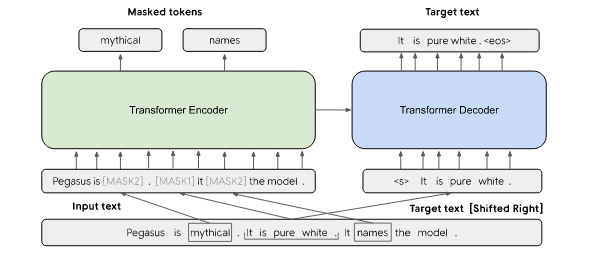

# Extractive Summarization Using Pegasus

## Overview

The Pegasus model was proposed in [PEGASUS: Pre-training with Extracted Gap-sentences for Abstractive Summarization](https://arxiv.org/pdf/1912.08777.pdf) by Jingqing Zhang, Yao Zhao, Mohammad Saleh and Peter J. Liu on Dec 18, 2019.

PEGASUS uses an encoder-decoder model for sequence-to-sequence learning. In such a model, the encoder will first take into consideration the context of the whole input text and encode the input text into something called context vector, which is basically a numerical representation of the input text. This numerical representation will then be fed to the decoder whose job is decode the context vector to produce the summary.

  

